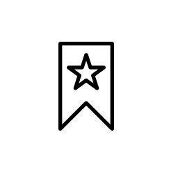

<!-- Improved compatibility of back to top link: See: https://github.com/othneildrew/Best-README-Template/pull/73 -->
<a name="readme-top"></a>


<!-- PROJECT SHIELDS -->
<!-- -->
[![Contributors][contributors-shield]][contributors-url]
[![Forks][forks-shield]][forks-url]
[![Stargazers][stars-shield]][stars-url]
[![Issues][issues-shield]][issues-url]
[![MIT License][license-shield]][license-url]
[![LinkedIn][linkedin-shield]][linkedin-url]


<!-- PROJECT LOGO -->
<br />
<div align="center">
  <a href="https://github.com/ahmadfarhan1981/pinboard-linkding-migrator">
    
  </a>

<h3 align="center">Pinboard to Linkding migrator</h3>

  <p align="center">
    The somewhat not necessary Pinboard to Linkding migrator 
    <br />
    <a href="https://github.com/ahmadfarhan1981/pinboard-linkding-migrator"><strong>Explore the docs »</strong></a>
    <br />
    <br />
    <a href="https://github.com/ahmadfarhan1981/pinboard-linkding-migrator">View Demo</a>
    ·
    <a href="https://github.com/ahmadfarhan1981/pinboard-linkding-migrator/issues">Report Bug</a>
    ·
    <a href="https://github.com/ahmadfarhan1981/pinboard-linkding-migrator/issues">Request Feature</a>
  </p>
</div>


<!-- TABLE OF CONTENTS -->
<details>
  <summary>Table of Contents</summary>
  <ol>
    <li>
      <a href="#about-the-project">About The Project</a>
    </li>
    <li>
      <a href="#getting-started">Getting Started</a>
      <ul>
        <li><a href="#prerequisites">Prerequisites</a></li>
        <li><a href="#installation">Installation</a></li>
      </ul>
    </li>
    <li><a href="#roadmap">Roadmap</a></li>
    <li><a href="#contributing">Contributing</a></li>
    <li><a href="#license">License</a></li>
    <li><a href="#contact">Contact</a></li>
  </ol>
</details>


<!-- ABOUT THE PROJECT -->
## About The Project
This is a script that takes a json export from [pinboard](http://pinboard.in) then, using the [Linkding REST API](https://github.com/sissbruecker/linkding/blob/master/docs/API.md), insert them into [Linkding](https://github.com/sissbruecker/linkding)

### <p style="text-align: center;">***NOBODY*** technically ***NEEDS*** this</p> ###
I didnt realize that Linkding supports importing of Netscape Bookmark File format. Exporting in that format in pinboard then is the prefered way of migrating from pinboard to Linkding.

By the time i realize this, I was already working on this project, so I decided to finish and publish this, despite the apparent uselessness. 

This project is also a way for me to practice language that I don't use at work, so I thought might as well continue and finish this.
<p align="right">(<a href="#readme-top">back to top</a>)</p>

## Limitations
### **This is *SLOWWWW*** 
The REST API doesnt provide a way to insert multiple bookmarks in a batch, so each bookmark that needs to be inserted is a single REST API call. 

My own json file with 2189 bookmarks took about 72 minutes. That is a rate of about 1.99 seconds per bookmarks insert. This is without any kind of parallelization on my side.

### **(Destructive operation) No checks for inserting URL that already exsits**
The REST API have no way to search for bookmarks based on URL. When inserting a URL that already exists, the behaviour of the REST API is to update the existing bookmarks with the info provided in the API call. This is a destructive process, potentially losing your existing notes and the tagging that you applied to the bookmark.

### **Create time for bookmarks will be at time of import**
The create time of the inserted bookmarks will be the time of the import. Currently the workaround is: the actual create time of the bookmarks will be prepended to the description of the bookmarks.

### Built With

* python
  
<p align="right">(<a href="#readme-top">back to top</a>)</p>


<!-- GETTING STARTED -->
## Getting Started

This is an example of how you may give instructions on setting up your project locally.
To get a local copy up and running follow these simple example steps.

### Prerequisites

* python
 
  You need python to run python scripts. Find the appropriate installation instruction for your platform. 
  
  On debian based Linux systems: (or any that uses apt as the package manager)
  ```sh
  apt install python3
  ```
* python virtual environment (optional, but recommended)
  ```sh
  python3 -m pip install --user virtualenv
  ```
* git (optional)
  Easiest way to get these files is cloning this repo using git. Alternatively you can download the files as a zip and extract it somewhere.
  
  On debian based Linux system:
  ```sh
  apt install git
  ``` 

### Installation

1. Clone the repo, then go into the directory that we cloned
   ```sh
   git clone https://github.com/ahmadfarhan1981/pinboard-linkding-migrator.git
   cd blabla
   ```
2. Create a virtual environment for the script (optional, but recommended)
   ```sh
   python3 -m venv env
   ```
   Then activate the virtual environment
   ```sh
   source env/bin/activate
   ```
3. Install the requirements
   ```bash
   pip install -r requirements.txt
   ``` 
4. Copy the example .env.example file as /env 
   ```bash
   cp .env.example .env
   ```
5. Edit the .env file.
   At least "PLM_LINKDING_API_KEY" & "PLM_LINKDING_URL" needs to be updated.
   ```js
   ...
   PLM_LINKDING_API_KEY = [your linkding REST API token. Found in Settings->Intergration]
   PLM_LINKDING_URL = [Your linkding URL without the trailing slash]
   ...
   ```
6. put the pinboard json export file into the same directory with the name "pinboard_export.json" (or update the "PLM_JSON_FILENAME" value in the .env file in step 5 to the name of your file) 
7. Run the script
   ```sh
   python3 ./main.py
   ```

<p align="right">(<a href="#readme-top">back to top</a>)</p>


<!-- ROADMAP -->
## Roadmap
I do want to continue extending this. Some of the things I have in mind are listed here, in no particular order.
- [ ] Flask webapp
- [ ] Insert directly into linkding database, if have access
- [ ] More import/export targets other than just pinboard/Linkding
- [ ] Modularization. Supporting mods to add import/export targets
- [ ] docker image for easier install/use

See the [open issues](https://github.com/ahmadfarhan1981/pinboard-linkding-migrator/issues) for a full list of proposed features (and known issues).

<p align="right">(<a href="#readme-top">back to top</a>)</p>


<!-- CONTRIBUTING -->
## Contributing

Contributions are what make the open source community such an amazing place to learn, inspire, and create. Any contributions you make are **greatly appreciated**.

If you have a suggestion that would make this better, please fork the repo and create a pull request. You can also simply open an issue with the tag "enhancement".
Don't forget to give the project a star! Thanks again!

1. Fork the Project
2. Create your Feature Branch (`git checkout -b feature/AmazingFeature`)
3. Commit your Changes (`git commit -m 'Add some AmazingFeature'`)
4. Push to the Branch (`git push origin feature/AmazingFeature`)
5. Open a Pull Request

<p align="right">(<a href="#readme-top">back to top</a>)</p>


<!-- LICENSE -->
## License

Distributed under the MIT License. See `LICENSE.txt` for more information.

<p align="right">(<a href="#readme-top">back to top</a>)</p>


<!-- CONTACT -->
## Contact

Ahmad Farhan - paan@ahmadfarhan.com

Project Link: [https://github.com/ahmadfarhan1981/pinboard-linkding-migrator](https://github.com/ahmadfarhan1981/pinboard-linkding-migrator)

<p align="right">(<a href="#readme-top">back to top</a>)</p>


<!-- MARKDOWN LINKS & IMAGES -->
<!-- https://www.markdownguide.org/basic-syntax/#reference-style-links -->
[contributors-shield]: https://img.shields.io/github/contributors/ahmadfarhan1981/pinboard-linkding-migrator.svg?style=for-the-badge
[contributors-url]: https://github.com/ahmadfarhan1981/pinboard-linkding-migrator/graphs/contributors
[forks-shield]: https://img.shields.io/github/forks/ahmadfarhan1981/pinboard-linkding-migrator.svg?style=for-the-badge
[forks-url]: https://github.com/ahmadfarhan1981/pinboard-linkding-migrator/network/members
[stars-shield]: https://img.shields.io/github/stars/ahmadfarhan1981/pinboard-linkding-migrator.svg?style=for-the-badge
[stars-url]: https://github.com/ahmadfarhan1981/pinboard-linkding-migrator/stargazers
[issues-shield]: https://img.shields.io/github/issues/ahmadfarhan1981/pinboard-linkding-migrator.svg?style=for-the-badge
[issues-url]: https://github.com/ahmadfarhan1981/pinboard-linkding-migrator/issues
[license-shield]: https://img.shields.io/github/license/ahmadfarhan1981/pinboard-linkding-migrator.svg?style=for-the-badge
[license-url]: https://github.com/ahmadfarhan1981/pinboard-linkding-migrator/blob/master/LICENSE.txt
[linkedin-shield]: https://img.shields.io/badge/-LinkedIn-black.svg?style=for-the-badge&logo=linkedin&colorB=555
[linkedin-url]: https://linkedin.com/in/linkedin_username
[product-screenshot]: images/screenshot.png
[Next.js]: https://img.shields.io/badge/next.js-000000?style=for-the-badge&logo=nextdotjs&logoColor=white
[Next-url]: https://nextjs.org/
[React.js]: https://img.shields.io/badge/React-20232A?style=for-the-badge&logo=react&logoColor=61DAFB
[React-url]: https://reactjs.org/
[Vue.js]: https://img.shields.io/badge/Vue.js-35495E?style=for-the-badge&logo=vuedotjs&logoColor=4FC08D
[Vue-url]: https://vuejs.org/
[Angular.io]: https://img.shields.io/badge/Angular-DD0031?style=for-the-badge&logo=angular&logoColor=white
[Angular-url]: https://angular.io/
[Svelte.dev]: https://img.shields.io/badge/Svelte-4A4A55?style=for-the-badge&logo=svelte&logoColor=FF3E00
[Svelte-url]: https://svelte.dev/
[Laravel.com]: https://img.shields.io/badge/Laravel-FF2D20?style=for-the-badge&logo=laravel&logoColor=white
[Laravel-url]: https://laravel.com
[Bootstrap.com]: https://img.shields.io/badge/Bootstrap-563D7C?style=for-the-badge&logo=bootstrap&logoColor=white
[Bootstrap-url]: https://getbootstrap.com
[JQuery.com]: https://img.shields.io/badge/jQuery-0769AD?style=for-the-badge&logo=jquery&logoColor=white
[JQuery-url]: https://jquery.com 


